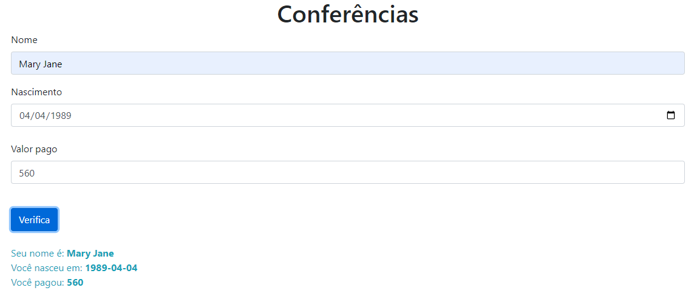

*You need downloading the node_modules files for this.

## Table of contents

- [Overview](#overview)
  - [Screenshot](#screenshot)
  - [Links](#links)
- [My process](#my-process)
  - [Built with](#built-with)
  - [What I learned](#what-i-learned)

## Overview
Training fields with TypeScript

### Screenshot



## My process

### Built with

- Semantic HTML5 markup
- CSS custom properties
- Flexbox
- CSS Grid
- Mobile-first workflow
- [TypeScript](https://www.typescriptlang.org/) - TS library
- [Bootstrap](https://getbootstrap.com/) - Boostrap

### What I learned

Use this section to recap over some of your major learnings while working through this project. Writing these out and providing code samples of areas you want to highlight is a great way to reinforce your own knowledge.

To see how you can add code snippets, see below:

```html
<div class="text-info"></div>
```
```css
a.text-info:hover, a.text-info:focus {
  color: #0f6674 !important;
}
```
```ts model
get dados(): void{
        return `Seu nome é: <strong>${this._nome}</strong> <br>
        Você nasceu em: <strong>${this._nascimento}</strong> <br>
        Você pagou: <strong>${this._valor}</strong>` 
     }
```

```ts controller
import { Conferencia } from "../models/conferencia.js"

export class conferenciaController{
    private imprime: HTMLDivElement

    constructor(){
        this.imprime = document.querySelector('.text-info') 
    }
    
    verifica(): void {
        const conferencia = this.criaVerificacao()
        console.log(conferencia)
        this.imprime.innerHTML = conferencia.dados
        this.limpaFormulario()
    }
 }
```

```ts app
import { conferenciaController } from "./controllers/conferencia.controller.js";
 
 const controller = new conferenciaController()
 const form = document.querySelector('.form')

 form.addEventListener('submit', event =>{
    event.preventDefault()
    controller.verifica()
 })
```
